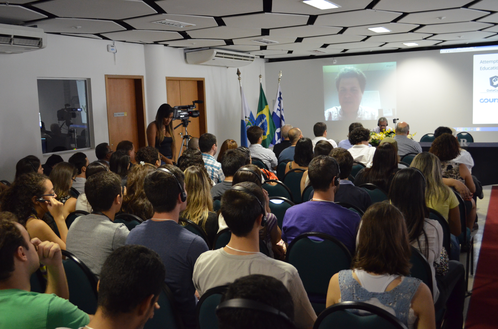

```{r setup, include=FALSE}
knitr::opts_chunk$set(echo = FALSE)
```

There is always good reasons to come to Rio! However, this time we are not talking about samba or soccer! Here we are also developping research and doing science... in this case with R.

## I SER - Niterói - Rio de Janeiro
International Statistics Seminar with R

{width=150%}

Three years have passed since our first event and it seems like today. Some of us were learning the first commands while others mastering advanced concepts. 


"The community of R users is already a large one, and knowing R leads to an edge in the job market. Since then,  we realized that there was no large R event in Brazil. Thus,  we proposed this first event with the objetive to expand and qualify R users"(Luciane Alcoforado - I SER intervew).

SER- Innovation and Professional Performance - took place on May 2016, 10-11th at UFF- Fluminense Federal University, for surprise of many, more than 250 people were present to this encounter, even the dean Prof. Sidney Luiz de Matos Mello.


There were plenary talks, posters presentations, experimental lab sessions, and mini courses.


Two international presentations took place: prof. Manuel Bande Febrero, Santiago Compostela University (Spain) - Dynamic reports in R with LateX or HTML, and Sean Kross online - The swirl R package: Learn R in R, among several domestic talks. The full program is avaiable [I SER](http://www.serrio2016.weebly.com/).





I SER was a great achievement for the R community in Brazil as shown by numbers: 216 students or practitioners, 15 speakers, 9 public officials, 52 faculty members. 

"The importance of data in administrative matters increases every year, with widespread use. Thus, decision-making or research becomes dependent on the knowledge of statistical procedures and information technology. R  bridges this gap by allowing meaningful data analysis, even when the user does not possess deep knowledge of those subjects. The student or practioneer leverages from developer's knowledge, such as in the case of a driver who is able to drive without having to know how to project or build an automobile. By understanding basic commands, and packages, more sophisticated statistical procedures are made possible. 

Data Science  became popular and R makes it accessible to a diverse number of fields. The statistician and the programmer understand and develop the supporting theory behind the R packages, whereas researchers or professionals from other areas may use them just as tools to comprehend the processes, and then develop solutions. 

The first initiative, coordinated by Professor Luciane F. Alcoforado, crowns the goal of spreading  R throughout the Fluminense Federal University. The success of the effort shows that the assumption that  it would not be necessary to know the potential audience for R in the university was a correct one." (prof.Ariel Levy - Vice-Coordinator of SER event ). 

## II SER - The World of Big Data Analysis

II SER took place 2017, may 23rd and 24th at NAB Auditorium in UFF. Before the oppening section Sillas Gonzaga presents all his passion for R, showing the blog "Paixão por Dados" (passion for data) with more than 3000 accesses. In his second participation at the SER series, he showed some features of his packages. 

After the oppennig section, plenary talks were given by our Iberian guests, Prof. Torgo, Univesidade do Porto - Portugal, and Prof. Bande, Santiago de Compostela University - Spain.

Prof. Torgo  is a well known R user with production in data mining. His talk on Performance Estimation brought up several forecasting techniques and their specificities as well as the variables and parameters that could be adjusted to  hundreds of possible approaches and could be applied when choosing a forecasting model. 


Manuel Febrero Bande lecture on Time Series with R was a very productive lesson which was followed  by Pedro Ferreira (Getúlio Vargas  Foundation) who presented Brazilian Economic Time Series (BETS) package.


A panel discussion on The World of Big Data Analysis marked the  scientific schedule end for the day. A terrace sunset gathering  where participants enjoy networking and a unique sightseeing of the Guanabara Bay and Rio’s skyline by night.


As in first edition,  during the second  day, there were  poster sessions, contributed panels  and an award for the 3 best works of each group. 


Full attendance was noticed in many of the minicourses: How and Where to Begin with R (Ariel Levy); GGplot2 - Plots with R (Luciane Alcoforado); Artificial Inteligence with R (Alex Laier); Generalized Linear Models with R (José Rodrigo Moraes); Dashboards Development with R (Steven Ross) full catalog of minicourses is disposed at [II SER](http://www.ser.uff.br/)


The numbers confirm that II SER was a huge success especially if you take into account the economical scenario in Brazil. The attendance was: 194 students and practitioners, 25 presenters, 6 public officials, 60 faculty members, and not to be forgoten the 35 volunteers that complemented the organizing team.
 
 
## What's next?

Although some people would say that the winter is comming , the truth is... there is never winter in Rio! 
We invite you to the [III SER](http://www.ser.uff.br), that will take place 2018, may/22nd-24th.


Registration to the III SER and minicourses are open. 

Remember  they get full really soon. The call for papers is also open until 2018, March 23rd. We are sure you will enjoy and learn! 


